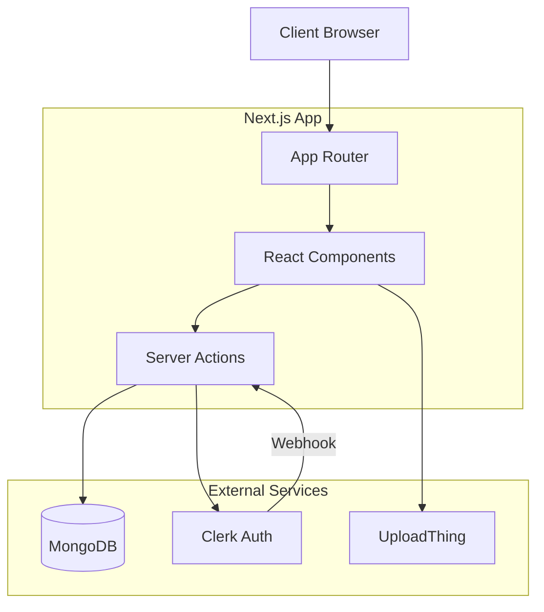

# Architecture Overview

Welcome to the Postcard architecture documentation. This guide provides a high-level overview of the system and links to detailed documentation for specific subsystems.

## System Overview

Postcard is a **Full-Stack Next.js Application**. It combines the frontend UI and backend logic into a single deployable unit.

- **Frontend**: React Server Components + Client Components (Next.js App Router).
- **Backend**: Server Actions (Node.js runtime).
- **Database**: MongoDB (Data persistence).
- **Auth**: Clerk (Identity management).
- **Storage**: UploadThing (Image hosting).

## High-Level Diagram

## Detailed Documentation

Please refer to the following documents for in-depth details:

- **[Database Schema](DATABASE_SCHEMA.md)**: Mongoose models, relationships, and ER diagram.
- **[Authentication Flow](AUTHENTICATION_FLOW.md)**: Clerk integration, webhooks, and middleware.
- **[Frontend Structure](FRONTEND_STRUCTURE.md)**: App router layout, component hierarchy, and styling.
- **[Server Actions](SERVER_ACTIONS.md)**: Data fetching and mutation logic.
