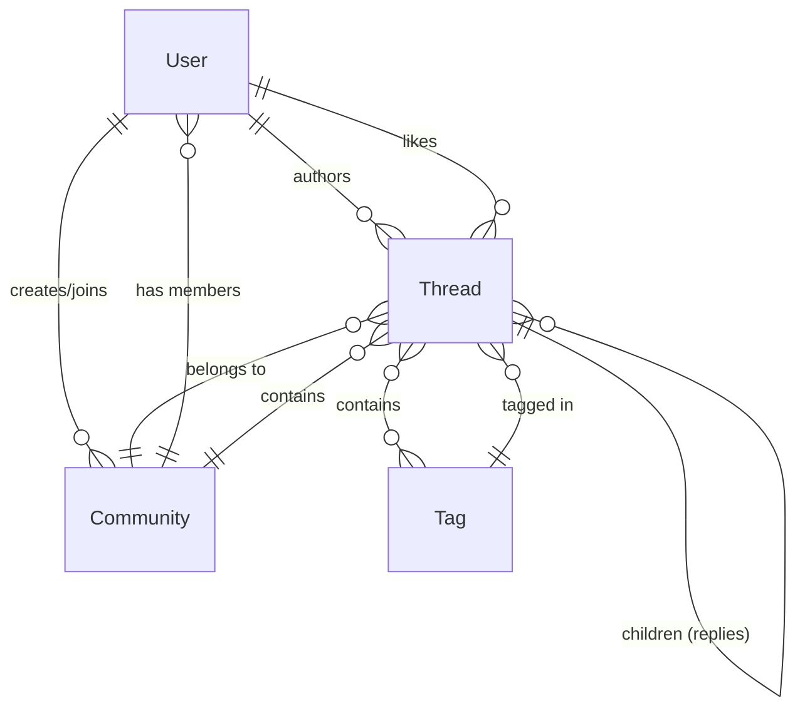

# Database Schema

Postcard uses **MongoDB** as its primary database, interacting with it via **Mongoose** ODM. The schema is designed to support a social network structure with users, threaded conversations, communities, and tagging.

## Models

### 1. User (`lib/models/user.model.ts`)
Represents a registered user of the application.
- **id**: String (Clerk ID, unique)
- **username**: String (unique)
- **name**: String
- **image**: String (URL)
- **bio**: String
- **threads**: Array of ObjectIds (References `Thread`)
- **onboarded**: Boolean
- **communities**: Array of ObjectIds (References `Community`)

### 2. Thread (`lib/models/thread.model.ts`)
Represents a post or a comment. The recursive structure allows for infinite nesting of comments.
- **text**: String
- **author**: ObjectId (References `User`)
- **community**: ObjectId (References `Community`)
- **createdAt**: Date
- **parentId**: String (ID of the parent thread if it's a comment)
- **children**: Array of ObjectIds (References `Thread` - replies)
- **likedBy**: Array of ObjectIds (References `User`)
- **tags**: Array of Strings (Hashtags extracted from text)
- **mentionedUsers**: Array of ObjectIds (References `User`)

### 3. Community (`lib/models/community.model.ts`)
Represents a group or community.
- **id**: String (Clerk Organization ID, unique)
- **username**: String (unique)
- **name**: String
- **image**: String (URL)
- **bio**: String
- **createdBy**: ObjectId (References `User`)
- **threads**: Array of ObjectIds (References `Thread`)
- **members**: Array of ObjectIds (References `User`)

### 4. Tag (`lib/models/tag.model.ts`)
Represents a hashtag used in posts. Used for trending topics.
- **name**: String (unique)
- **threads**: Array of ObjectIds (References `Thread`)
- **createdOn**: Date

## Entity-Relationship Diagram

